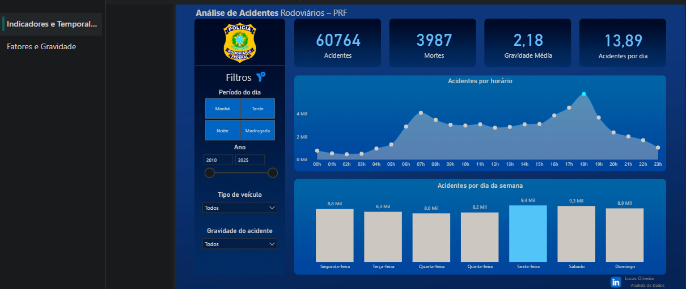
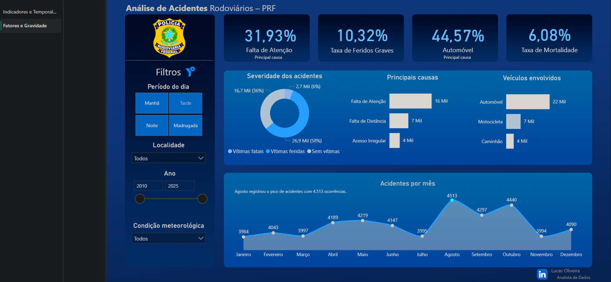

# 📊 Análise de Acidentes Rodoviários no RN - PRF (2010-2025)
### Transformando dados em insights para segurança viária (2010-2025)

## 📌 Visão Geral do Projeto
Este projeto analisa os acidentes em rodovias federais que cortam o estado do **Rio Grande do Norte**. O foco principal foi identificar padrões temporais, causas predominantes e perfis de gravidade para apoiar estratégias de prevenção de acidentes.

O diferencial deste trabalho é a **metodologia de organização de dados**, garantindo que a análise final no Power BI fosse alimentada por dados limpos e bem estruturados.

---

## 📈 Conclusões da Análise (Insights)
A partir do dashboard interativo, foi possível extrair padrões críticos:

* **Ponto de Atenção:** O maior volume de sinistros ocorre às **sextas-feiras**, com um pico alarmante às **18h** (fluxo de saída para viagens/final de expediente).
* **Fator Humano:** A **"Falta de Atenção"** representa mais de 31% das causas, sendo o principal motivador de acidentes, superando falhas mecânicas.
* **Perfil de Risco:** Automóveis de passeio são responsáveis por 44% das ocorrências, permitindo direcionar campanhas de conscientização específicas.

---

## 🛠️ Metodologia e Ferramentas

### 🐍 Tratamento de Dados (Python)
Os dados foram extraídos do Kaggle e passaram por um processo de tratamento utilizando Python no VS Code para garantir a integridade da análise:
* **Bronze:** Ingestão dos dados brutos.
* **Silver:** Limpeza, padronização de tipos e remoção de duplicidade.
* **Gold:** Enriquecimento com novas variáveis (Período do Dia, Faixas Horárias).

### 📊 Business Intelligence (Power BI)
* **Modelagem:** Estruturação em **Star Schema** para garantir performance nos filtros.
* **Métricas:** Medidas em **DAX** para calcular índices de mortalidade, gravidade e volume de acidentes dentro do estado.. 
* **UX/UI:** Layout planejado em *Dark Mode* para facilitar a leitura e destacar os KPIs principais.

---

## 🖼️ Visualização do Painel

### Dashboard de Indicadores Temporais
Foco no volume total e janelas críticas de horários.
> 

### Análise de Fatores e Severidade
Detalhamento de causas, tipos de veículos e gravidade dos danos.
> 

## 🔗 Acesso ao Dashboard
👉 **[Clique aqui para acessar o Dashboard no Power BI Service](https://app.powerbi.com/view?r=eyJrIjoiZTNmOGNiN2YtN2MyMS00MzdkLWE1ODUtNjAxNTg0MzI5ZmI4IiwidCI6ImIxZjQxMDEzLWU0NDUtNGIzNS1hNzA4LTA2YTk5ZTZjZWQ2ZSJ9)**

---

## 📂 Estrutura do Repositório
* `notebooks/`: Scripts Python com o passo a passo do tratamento.
* `data/`: Estrutura de pastas da metodologia de dados.
* `dashboard/`: Arquivo .pbix para interação.
* `imagens/`: Capturas de tela para documentação.

---

## 👤 Autor
**Lucas Oliveira** - *Analista de Dados* 
